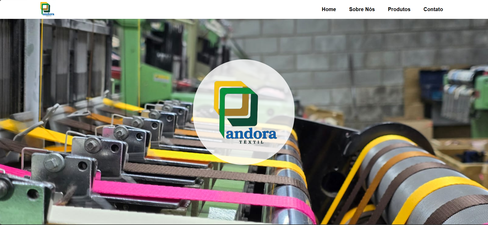

#  Site Institucional - Pandora Textil

Este é um projeto de site institucional desenvolvido para a Pandora Textil, com o objetivo de apresentar a marca, seu catálogo de produtos e canais de atendimento de forma moderna, responsiva e performática. 

O projeto faz parte do meu portfólio pessoal e foi construído utilizando **React** para a componentização e gerenciamento de estado da interface.

---

## 🚀 Tecnologias Utilizadas

* **React** (Biblioteca principal para construção da interface)
* **Tailwind CSS** (Estilização utilitária e responsividade)
* **React Icons** (Conjunto de ícones flexíveis)
* **Vite** (Ferramenta de build rápida para o ecossistema frontend)

---

## 🛠️ Funcionalidades Principais

* **Design 100% Responsivo:** Interface otimizada para dispositivos móveis, tablets e desktops.
* **Seções Institucionais:** Páginas/seções dedicadas à história da empresa, valores, catálogo de produtos e serviços.
* **Formulário de Contato:** Validação básica de campos para simulação de envio de mensagens ou redirecionamento para o WhatsApp da empresa.
* **Componentes Reaproveitáveis:** Cards de produtos, botões de ação (CTA) e cabeçalhos estruturados para fácil manutenção.
